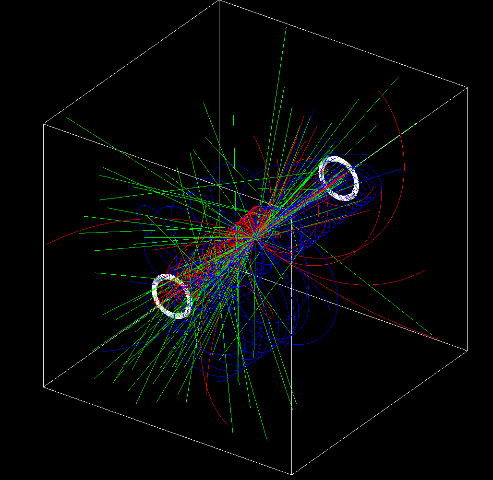
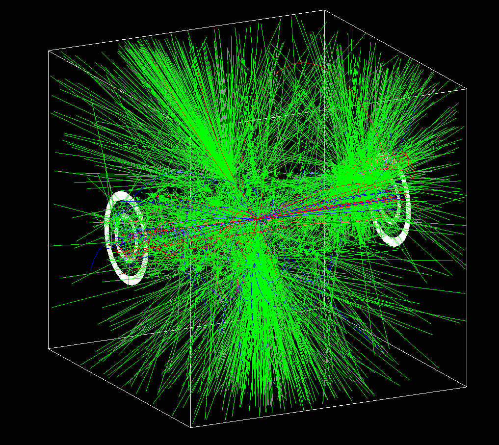
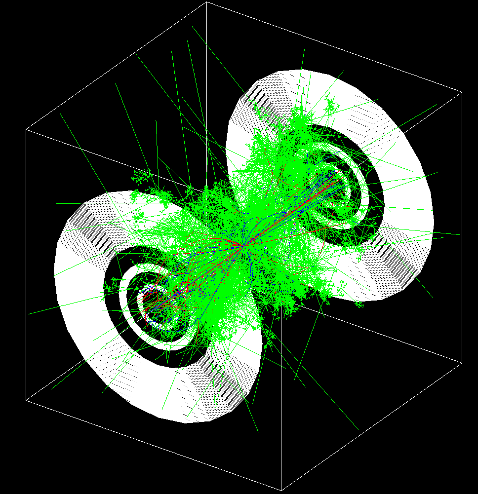

# Detector Simulation

This module handles the interaction of simulated final-state particles with a hypothetical detector design.

## Design

<table align="center">
  <tr>
    <td align="center" width="33%">
      <br/>
      <sub>Tracker only</sub>
    </td>
    <td align="center" width="33%">
      <br/>
      <sub>Tracker + ECAL</sub>
    </td>
    <td align="center" width="33%">
      <br/>
      <sub>Tracker + ECAL + HCAL</sub>
    </td>
  </tr>
</table>

1. Inner chamber
    1. Radius: 500 mm
2. Tracker system: 10 layers in a 2 T magnetic field
    1. 0.2 mm silicon (active)
    2. 14.8 mm galactic vacuum (passive)
3. First gap
    1. 350 mm galactic vacuum
4. ECAL: 60 layers
    1. 2.5 mm lead (passive absorber)
    2. 2 mm polystyrene (active scintillator)
5. Second gap
    1. 500 mm galactic vacuum
6. HCAL: 96 layers
    1. 14 mm steel (passive absorber)
    2. 2 mm polystyrene (active scintillator)

## Configuration

The detector configuration can be found in `resources/configuration.toml`.

Note that the configuration format is custom and does not follow any existing standard, as no suitable standard could be identified for this use case.

## Input

This program requires an HEPMC3-formatted file containing final-state particle events located at `data/events.hepmc3`. This file can be generated using the `event-generation` module.

## Output

The output consists of a set of ROOT files (one per thread) stored in `data/` and named `detector_simulation_t#.root`.

These files can be merged using the following command:

```sh
hadd detector_simulation.root detector_simulation_t*.root
```

### ROOT File Contents

Each stepping action is recorded with the following data fields:

- Event ID
- Layer ID
- Track ID
- PDG code
- X position
- Y position
- Z position
- Energy deposited

## Results

The following energy-deposition maps show the detector response in the transverse plane (XY) for different particle species. The maps use logarithmic energy scaling.

The simulation was performed using only 500 events.

### Leptons

<table align="center">
  <tr>
    <td align="center" width="25%">
      <br/>
      <sub>Electron (PDG = 11)</sub>
    </td>
    <td align="center" width="25%">
      <br/>
      <sub>Positron (PDG = -11)</sub>
    </td>
    <td align="center" width="25%">
      <br/>
      <sub>Muon (PDG = 13)</sub>
    </td>
    <td align="center" width="25%">
      <br/>
      <sub>Antimuon (PDG = -13)</sub>
    </td>
  </tr>
</table>

### Electromagnetic Particles

<table align="center">
  <tr>
    <td align="center" width="50%">
      <br/>
      <sub>Photon (PDG = 22)</sub>
    </td>
  </tr>
</table>

### Hadrons

<table align="center">
  <tr>
    <td align="center" width="50%">
      <br/>
      <sub>Charged pion π⁺ (PDG = 211)</sub>
    </td>
    <td align="center" width="50%">
      <br/>
      <sub>Charged pion π⁻ (PDG = -211)</sub>
    </td>
  </tr>
</table>
